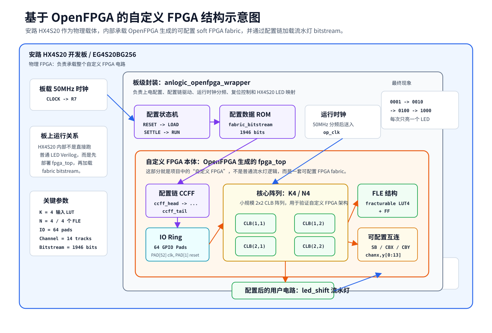

# OpenFPGA on Anlogic HX4S20 LED Demo

本项目演示将 OpenFPGA 生成的自定义 FPGA fabric 部署到安路 HX4S20 FPGA 开发板上，并在该 soft FPGA 内运行一个 LED 流水灯用户电路。

## 项目目标

这个工程不是直接在安路 FPGA 上写一个普通流水灯，而是先用 OpenFPGA 生成一个可配置 FPGA 结构，再把该结构作为普通 Verilog 逻辑综合到安路 HX4S20 芯片中。流水灯逻辑被映射到自定义 FPGA fabric 内部，通过配置 bitstream 写入后运行。

## 当前实验现象

板载 4 个 LED 按 one-hot 方式依次点亮，即任意时刻主要只有一个 LED 处于点亮状态，形成肉眼可见的流水灯效果。

## 目录结构

```text
.
├── td/
│   ├── anlogic_openfpga_onehot_led.v       # TD 中只需导入的 Verilog 源文件
│   └── anlogic_openfpga_wrapper.adc        # HX4S20 管脚约束
├── openfpga_artifacts/
│   ├── fpga_top.v                          # OpenFPGA 生成的 fabric 顶层
│   ├── fabric_bitstream.bit                # fabric 配置 bitstream
│   └── fabric_independent_bitstream.xml    # OpenFPGA 独立 bitstream 描述
├── native_led_test/
│   ├── hx4s20_led_chase.v                  # 原生 FPGA 流水灯对照测试
│   └── hx4s20_led_chase.adc
└── docs/
    ├── custom_fpga_structure_diagram.svg
    ├── custom_fpga_structure_diagram.md
    ├── resource_usage.md
    └── workflow.md
```

## TD 使用方法

1. 新建 TD 工程，器件选择实际开发板对应的 HX4S20 型号。
2. 添加 Verilog 源文件：`td/anlogic_openfpga_onehot_led.v`。
3. 设置顶层模块为：`anlogic_openfpga_wrapper`。
4. 添加约束文件：`td/anlogic_openfpga_wrapper.adc`。
5. 运行综合、布局布线、生成 bitstream。
6. 下载到板卡，观察 4 路 LED 的 one-hot 流水灯现象。

注意：不要把 `openfpga_artifacts/` 里的测试平台文件或 OpenFPGA 中间 netlist 全部加入 TD 工程。当前 TD 版本只需要导入 `td/anlogic_openfpga_onehot_led.v` 和对应 `.adc`。

## 自定义 FPGA 体现在哪里

自定义 FPGA 的核心体现在 `fpga_top` 及其内部的可配置结构，包括：

- 可配置逻辑块 CLB / FLE / LUT / FF。
- 可配置互连网络，包括 switch block、connection block 和 routing channel。
- CCFF 配置链，用于把 `fabric_bitstream.bit` 写入 fabric。
- 用户电路 `led_shift` 被映射到该 fabric 内部，而不是直接作为普通 RTL 接到 LED。

外层 `anlogic_openfpga_wrapper` 负责板级适配、时钟分频、配置加载、复位控制和 LED 映射。

## 资源占用

当前在 TD 中综合布局后的主要资源占用见 [docs/resource_usage.md](docs/resource_usage.md)。

## 结构示意图



## 版权说明

本仓库不包含厂商数据手册 PDF。公开发布时请确认所有第三方文件、开发板资料和工具生成物的许可条件。
