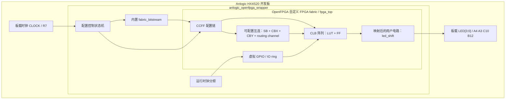

# 自定义 FPGA 结构示意图

本图说明当前项目中“安路 HX4S20 物理 FPGA”和“OpenFPGA 生成的自定义 soft FPGA fabric”之间的层次关系。

## 层次说明

- HX4S20 是真实物理芯片，负责承载整个 soft FPGA。
- `anlogic_openfpga_wrapper` 是板级封装，负责时钟、复位、配置加载和 LED 映射。
- `fpga_top` 是 OpenFPGA 生成的自定义 FPGA fabric。
- `fabric_bitstream` 通过 CCFF 配置链写入 fabric，使 LUT、FF 和路由网络形成 LED 流水灯电路。
- LED 现象来自 soft FPGA 内部被配置后的用户电路，而不是普通 RTL 直接驱动 LED。
